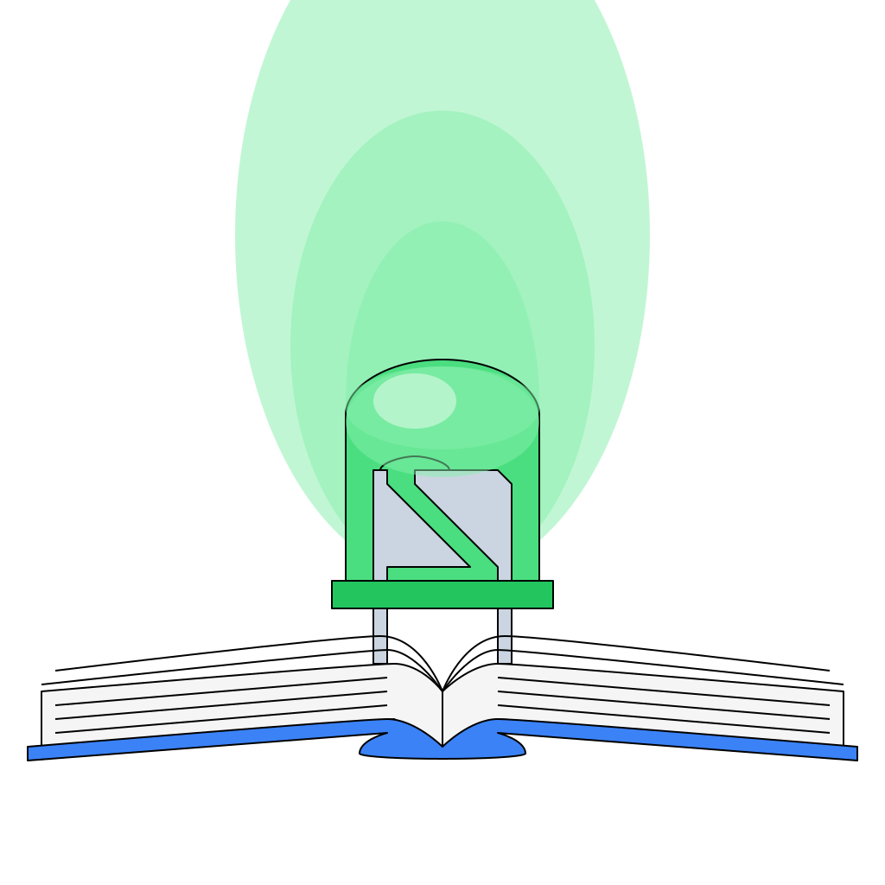

# Shisō no Senshi

<!-- PROJECT SHIELDS -->

  

## Overview

Shisō no Senshi is a cross platform personal knowledge manager. It is designed from the ground up to be secure and leave complete control of your knowledge in your hands.

[**Read the Docs**](/wiki)

[Report a Bug](/issues/new?labels=bug&template=bug_report.yaml)

[Request a Feature or Enhancement](/issues/new?labels=enhancement&template=feature_request.yaml)

### Built With

- <a href="https://dioxuslabs.com/">&nbsp;DIOXUS</a>

- <a href="https://nodejs.org/">&nbsp;Node.js</a>

- <a href="https://pnpm.io/">&nbsp;PNPm</a>

- <a href="https://tailwindcss.com/">&nbsp;tailwindcss</a>

## Getting Started

TODO

### Prerequisites

TODO

### Installation

TODO

## Contributing

Contributions are what make the open source community such an amazing place to learn, inspire, and create. Any contributions you make are **greatly appreciated**.

For details, follow our [Contributing](CONTRIBUTING.md) guide. All developers must agree to the [Developer Certificate of Origin](DCO.md).

### Top contributors

## Legal

 Shisō no Senshi is Copyright &copy; 2025 [JEleniel](https://github.com/JEleniel) and released under the [GPL 3.0](LICENSE.md) license.

 The doccumentation for Shisō no Senshi is Copyright © 2025 [JEleniel](https://github.com/JEleniel) and is licensed under the [Creative Commons Attribution-NonCommercial-ShareAlike 4.0 International](<https://creativecommons.org/licenses/by-nc-sa/4.0/>) license. 🅭 🅯 🄏 🄎

## Contact

[JEleniel](https://github.com/JEleniel): <jeleniel+shiso@crystultima.org>

Project Link: [https://github.com/Shiso-no-Senshi/shiso-no-senshi](https://github.com/Shiso-no-Senshi/shiso-no-senshi)
