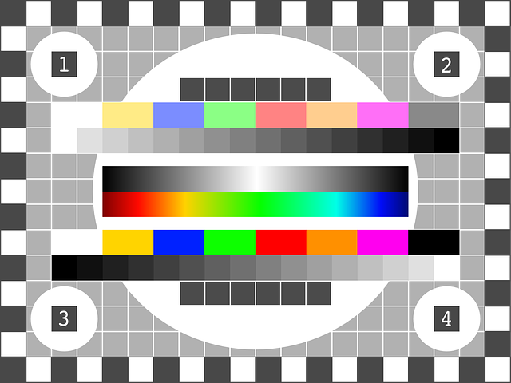

# Markdown Formatting Test

## Headings

```Markdown
# Level 1 Heading
## Level 2 Heading
### Level 3 Heading
#### Level 4 Heading
##### Level 5 Heading
###### Level 6 Heading

Level 1 Heading Alternative
==

Level 2 Heading Alternative
--

### Heading with Id {#heading-id}
```

# Level 1 Heading

## Level 2 Heading

### Level 3 Heading

#### Level 4 Heading

##### Level 5 Heading

###### Level 6 Heading

Level 1 Heading Alternative
==

Level 2 Heading Alternative
--

### Heading with Id {#heading-id}

## Breaks

This is a space  
forced line break

This is an HTML<br />line break.

## Text Styles

- **Bold**
- __Alternative Bold__
- *Italic*
- _Alternative Italic_
- ***Bold Italic***
- **_Bold Alternative Italic_**
- __*Alternative Bold Italic*__
- ___Alternative Bold Alternative Italic___
- ~~Strikethrough~~
- Emoji :smile: :heart: :joy: ::joy::
- ==Highlight==
- Sub~script~
- Super^script^

## Quotes 

> Simple Block Quote
>
> > Nested Block Quote

## Lists

### Ordered

1. Ordered
2. List

---

1. Alternate
1. Ordered
1. List

### Unordered

-   Unordered
-   List

---

* Alternate
* Unordered
* List

---

+ Another Alternative
+ Unordered
+ List

---

- 1900\. Unordered list with a leading number and period
	And some text indented with the list.
	> And a Blockk Quote

### Task

- [ ] Todo
- [x] Done, lowercase
- [X] Done, uppercase

### Nested

- Unordered
	1. Ordered
	1. List
   		- [ ] Task
- List

### Code Blocks

`inline`

	{
		"description": "indented"
	}


```
{
	"description": "fenced"
}
```

```json
{
	"description": "fenced with language"
}
```

```json Title
{
	"description": "fenced with language and title"
}
```

### Images


[Samurai Helmet Icon](https://commons.wikimedia.org/wiki/File:Samurai_Helmet_Icon.svg)
RootOfAllLight, CC BY-SA 4.0 <https://creativecommons.org/licenses/by-sa/4.0>, via Wikimedia Commons


[Tv-test-pattern-146649 640.png](https://commons.wikimedia.org/wiki/File:Tv-test-pattern-146649_640.png)
HAL2000JUST, CC BY-SA 4.0 <https://creativecommons.org/licenses/by-sa/4.0>, via Wikimedia Commons

## Callouts

> [!note] Note with a Title

> [!note]+ Foldable Callout
> Default to unfolded

> [!note]- Foldable Callout
> Default to folded

> [!important] Nested
> > [!note] Callouts

> [!abstract]
> summary, tldr

> [!info]

> [!todo]

> [!success]
> check, Done

> [!tip]
> hint, important

> [!question]
> help, faq

> [!warning]
> caution, attention

> [!failure]
> fail, missing

> [!danger] 
> error

> [!bug]

> [!example]

> [!quote]
> cite

> [!:smile: Emoji]

## Horizontal Rules

Normal

---

Alternate 1

***

Alternate 2

___


### Links

[Link](https://duckduckgo.com)

[Link with Tooltip](https://duckduckgo.com "With a tooltip")

[Link with Angle Brackets](<https://duckduckgo.com>)

<https://duckduckgo.com>

<fake@example.com>

[`Link as Code`](https://duckduckgo.com)

[Reference Link][1]

[1]: "Duck Duck Go" <https://duckduckgo.com>

[Heading](#heading-1)

[Heading by ID](#heading-id)

[](images/Samurai_Helmet_Icon.svg)


### Escaped Characters

Character | Description
:---: | --- 
\\ | Reverse Solidus (Backslash)
\` | Grave Accent (Backtick)
\* | Asterisk
\_ | :ow Line (Underscore)
\{\} | Curley Brackets
\[\] | Square Brackets
\<\> | Less-Than and Greater-Than Signs (Angle Brackets)
\(\) | Parenthesis
\# | Number Sign (Hash Sign)
\+ | Plus
\- | Hyphen-Minus
\. | Full Stop (Period, Dot)
\! | Exclamation Mark (Bang)
\| | Vertical Line (Pipe, Vertical Bar)

### HTML

<p><strong>strong<br /><em>strong emphasis</em></strong></p>

### Tables

| Normal | Left | Center | Right |
| --- | :--- | :---: | ---: |
| W | X | Y | Z |
| 1.23 | 1.23 | 1.23 | 1.23 |
| Redrum | Redrum | Redrum | Redrum |


### Footnote

Simple[^1]

Named[^Named]

[^1]: "Simple" <http://duckduckgo.com>

[^Named]: "Named" <http://duckduckgo.com>

## Comments

```Markdown
%% Comment %%
<!-- Comment -->
```

%% Comment %%

<!-- Comment -->

## Text

Lorem ipsum dolor sit amet, consectetur adipiscing elit. Vivamus quis leo vehicula, ultricies velit id, dapibus sem. Nulla facilisi. Duis convallis ullamcorper erat, eu ultricies est lobortis et. Praesent rhoncus quam vel libero dignissim rutrum. Phasellus enim mi, eleifend et hendrerit nec, convallis et enim. Aliquam erat volutpat. Class aptent taciti sociosqu ad litora torquent per conubia nostra, per inceptos himenaeos. Phasellus non velit tellus.

Fusce egestas urna mi. Nunc rhoncus hendrerit felis, at venenatis mi venenatis sit amet. Integer vel est diam. Morbi eget nulla blandit, efficitur eros eget, faucibus dui. Pellentesque porta odio sed elementum mollis. Morbi nisi augue, feugiat at erat nec, aliquet vehicula libero. Nullam tempor magna pharetra quam elementum feugiat.

Phasellus tristique maximus convallis. Nunc non convallis turpis. Proin consequat ullamcorper nisi, eget tempus arcu condimentum quis. Donec eleifend turpis purus, at dapibus nisl posuere sit amet. Vivamus iaculis lorem id ante fermentum, vel aliquam lacus volutpat. Donec ligula felis, viverra sed nulla id, vestibulum molestie magna. Cras non dui vitae libero viverra condimentum eget quis est. Nullam nec risus nec mi tempus scelerisque id non neque. Curabitur ultrices est ante, at lacinia sem sagittis at. Ut vel hendrerit orci, eget ultricies mi. Mauris vitae lobortis mi. Class aptent taciti sociosqu ad litora torquent per conubia nostra, per inceptos himenaeos. Pellentesque ultricies lacus id massa rhoncus, scelerisque fringilla enim auctor. Integer a diam velit. Donec eu placerat neque, vitae egestas arcu.

Duis imperdiet dolor purus, a mollis elit congue eu. Cras euismod sapien justo, faucibus aliquet dui vulputate quis. Aliquam urna ipsum, egestas ac dictum in, tristique sit amet diam. Praesent vel purus posuere, fringilla nulla a, fringilla erat. Praesent condimentum risus non semper molestie. Quisque iaculis nulla enim, et porta risus fringilla at. In dignissim metus nec maximus semper. Pellentesque vehicula, sapien at varius euismod, erat enim consectetur enim, at volutpat purus massa eu leo. Vivamus suscipit, erat sed posuere maximus, urna orci dictum turpis, vel tristique lorem massa ut ligula. Ut molestie ipsum quam, imperdiet blandit dolor aliquet sed. Nulla ac diam a nisl ultrices varius quis vel enim. Mauris tincidunt nulla nisl, sed vulputate felis sagittis vitae. Ut fermentum nulla sit amet arcu mollis facilisis. Sed vel enim id ligula cursus eleifend.

Vestibulum eget sem vitae ante cursus pulvinar. Quisque suscipit ullamcorper dapibus. Pellentesque nec urna nibh. Sed nisl turpis, sollicitudin at commodo vel, consectetur sed dui. Donec id tortor a ligula volutpat luctus. Vestibulum auctor ante sit amet mattis egestas. Pellentesque ante purus, bibendum vitae faucibus ut, condimentum quis felis. Fusce vitae euismod elit.
