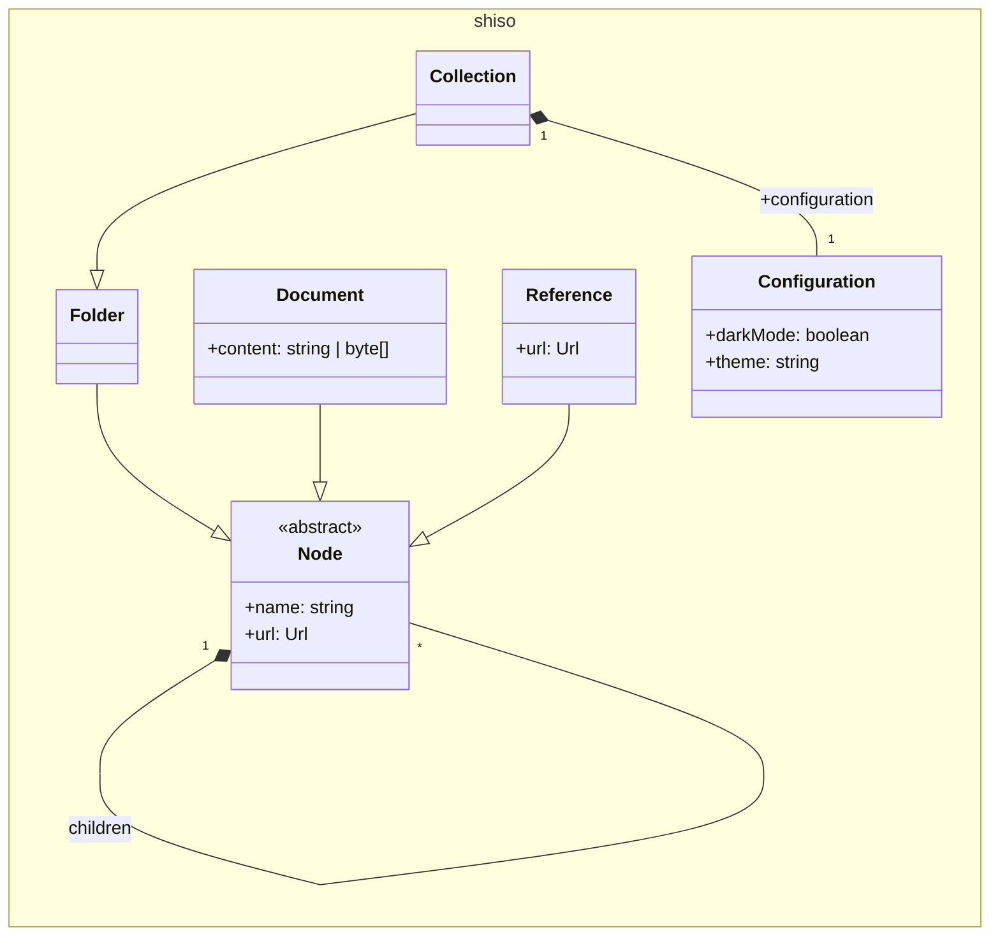
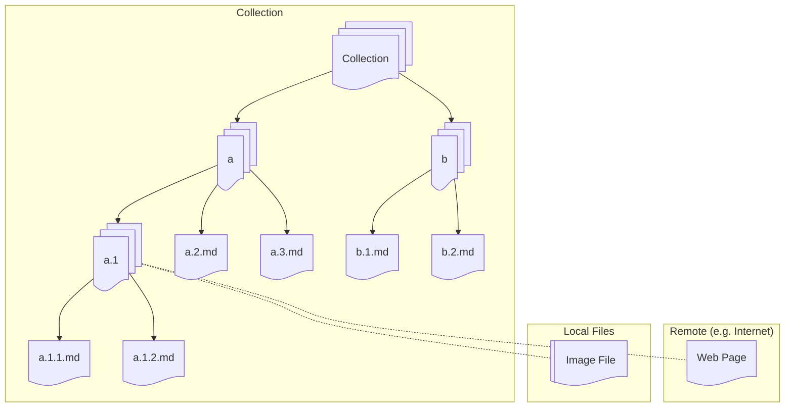
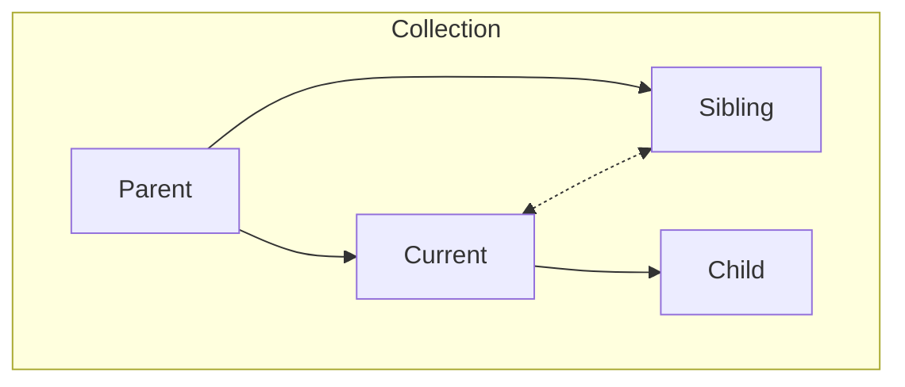

# Architecture

## Class Diagram

### Linking

1. Each node has zero or more "Child" nodes.
    1. Each node has exactly one Parent.
    2. The Parent owns the Child nodes.
    3. Deleting the Parent will delete all children, recursively.
2. Each node points to exactly one "Document"
    1. Documents can be internal or external to the collection.
    2. Deleting a node will delete

## Relationships

1. Every node has exactly one parent.
2. A "Child" node is the node pointed to by a "Parent" node.
3. A "Sibling" node is a node that either refers to or is referred to by the current node.
