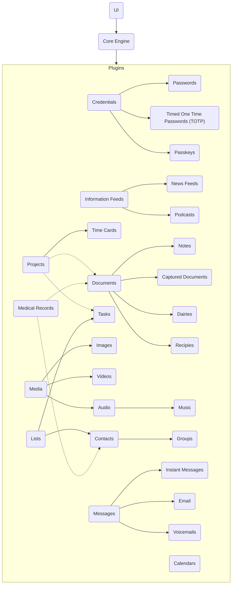

# Architecture

```mermaid
graph
	ui(UI)
		--> engine(Core Engine)
		--> plugins
	engine
	
	subgraph plugins[Plugins]
		credentials(Credentials)
		credentials --> passwords(Passwords)
		credentials --> totp("Timed One Time Passwords (TOTP)")
		credentials --> passkeys(Passkeys)

		feeds(Information Feeds)
		feeds --> news(News Feeds)
		feeds --> podcasts(Podcasts)

		projects(Projects)
		projects --> timecards(Time Cards)
		projects -.-> documents
		projects -.-> tasks

		documents(Documents)
		documents --> notes(Notes)
		documents --> captures(Captured Documents)
		documents --> dairies(Dairies)
		documents --> recipies(Recipies)

		media(Media)
		media --> images(Images)
		media --> videos(Videos)
		media --> audio(Audio)

		audio --> music(Music)

		calendars(Calendars)

		lists(Lists)
		lists --> contacts(Contacts)
		lists --> tasks(Tasks)

		contacts --> groups(Groups)

		messages(Messages)
		messages --> im(Instant Messages)
		messages --> email(Email)
		messages --> voicemails(Voicemails)

		medical(Medical Records)
		medical -.-> contacts
		medical -.-> documents
	end

```
